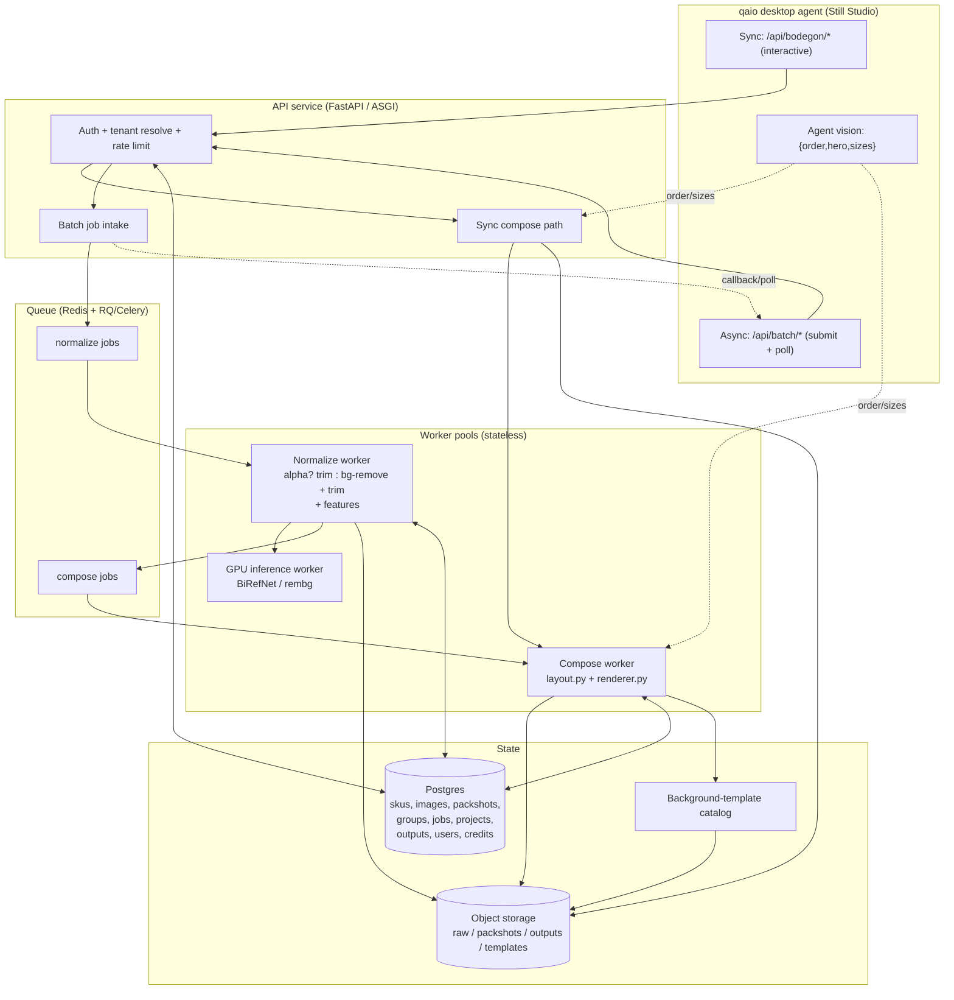

# Still Studio — Platform Architecture

> Status: **architecture spec, build-ready.** Supersedes nothing in `ROADMAP_PLATAFORMA.md`
> — it implements it. Read `../ROADMAP_PLATAFORMA.md` and `../ARQUITECTURA_Y_SEGURIDAD.md` first.
>
> Scope: turn the single-file StillAI FastAPI tool into a scalable, multi-tenant SaaS that a
> qaio desktop agent drives — across three phases (F1 local-batch MVP → F2 hosted platform →
> F3 monetized SaaS). The sacred boundary is preserved everywhere: **AI decides only
> `{order, hero, sizes}`; the deterministic engine (`layout.py` + `renderer.py`) composes.**

---

## 0. Invariants (do not violate in any phase)

1. **AI → `{order, hero, sizes}` only.** Composition is deterministic. The platform never
   moves pixels; it changes *strategy* or re-runs *order/sizes*. Same inputs ⇒ byte-identical PNG.
2. **`filename == SKU`.** `7501234.png` → SKU `7501234`. No external mapping dependency.
3. **User-directed grouping.** Groups come from a CSV (`grupo,sku`). The system resolves
   SKU→image and renders one bodegón per group. It never auto-groups.
4. **Normalization is the spine.** Mixed image states: detect alpha → opaque images get
   background removed → trim to content. This is risk #1 (see §10).
5. **Inference licensing boundary.** Internal/low-volume vision runs on the qaio subscription
   (the agent does it). SaaS/resale/mass-batch requires metered API keys or dedicated inference
   workers. Mode is explicit, never assumed.
6. **The sync single-bodegón endpoints stay forever.** They are the desktop agent's interactive
   path. The async batch API is *added alongside*, not a replacement.

---

## 1. Target architecture (F1 → F2 → F3)

### Component inventory

| Component | F1 (local MVP) | F2 (hosted platform) | F3 (SaaS) |
|---|---|---|---|
| **API service** | FastAPI (current, refactored to package) | FastAPI behind reverse proxy / ASGI workers | + tenant routing, API gateway, OpenAPI SDK |
| **Async queue** | `jobs` table in SQLite + in-process worker loop | Redis + RQ/Celery | + priority lanes, dead-letter queue |
| **Compose workers** | same process (thread/loop) | N stateless worker pods (CPU) | autoscaled by queue depth |
| **Inference / GPU worker** (bg-removal) | `rembg` (CPU, in worker loop) | **BiRefNet on GPU worker pool** | + metered external vision keys per tenant |
| **Object storage** | local disk (`./storage/`) | S3 / Azure Blob (per-tenant prefix) | + CDN for outputs, lifecycle policies |
| **Database** | SQLite (`still.db`) | Postgres | Postgres + read replicas |
| **Background-template store** | folder + `style.json` per style | object storage + DB catalog table | + style editor, optional generative |
| **Auth** | none (single local user, trusted) | session cookies + API keys | + OAuth/SSO, orgs, RBAC |
| **Credits/billing** | none | usage counters | metered credits + billing provider |

### F2/F3 target diagram



In F1 the same boxes collapse into one process: API + an in-process worker loop polling the
SQLite `jobs` table; storage is local disk; no auth/edge layer.

---

## 2. Data model

Schemas shown as Postgres DDL (F2 canonical). For F1, the same tables exist in SQLite minus
`tenant_id`/`user_id` FKs and with `TEXT` UUIDs / `INTEGER` timestamps. Money/credits and
multi-tenant columns are present in the schema from day one but unused in F1 (single tenant).

### `users` / `tenants`
```sql
CREATE TABLE tenants (
    id          UUID PRIMARY KEY DEFAULT gen_random_uuid(),
    name        TEXT NOT NULL,
    plan        TEXT NOT NULL DEFAULT 'free',        -- free | pro | enterprise
    created_at  TIMESTAMPTZ NOT NULL DEFAULT now()
);

CREATE TABLE users (
    id            UUID PRIMARY KEY DEFAULT gen_random_uuid(),
    tenant_id     UUID NOT NULL REFERENCES tenants(id),
    email         TEXT UNIQUE NOT NULL,
    password_hash TEXT NOT NULL,                      -- PBKDF2-HMAC-SHA256 (existing scheme)
    role          TEXT NOT NULL DEFAULT 'member',     -- owner | member
    created_at    TIMESTAMPTZ NOT NULL DEFAULT now(),
    deleted_at    TIMESTAMPTZ
);
CREATE INDEX idx_users_tenant ON users(tenant_id) WHERE deleted_at IS NULL;
```

### `credits` (F3; counters live in F2)
```sql
CREATE TABLE credit_ledger (
    id          UUID PRIMARY KEY DEFAULT gen_random_uuid(),
    tenant_id   UUID NOT NULL REFERENCES tenants(id),
    delta       INTEGER NOT NULL,                     -- + grant, - consumption
    reason      TEXT NOT NULL,                        -- 'compose' | 'bg_remove' | 'grant' | 'refund'
    job_id      UUID,                                 -- FK jobs(id), nullable
    created_at  TIMESTAMPTZ NOT NULL DEFAULT now()
);
CREATE INDEX idx_credit_tenant_time ON credit_ledger(tenant_id, created_at);
-- Balance = SUM(delta). Append-only ledger; never mutate rows.
```

### `projects`
```sql
CREATE TABLE projects (
    id          UUID PRIMARY KEY DEFAULT gen_random_uuid(),
    tenant_id   UUID NOT NULL REFERENCES tenants(id),
    name        TEXT NOT NULL,
    created_at  TIMESTAMPTZ NOT NULL DEFAULT now(),
    archived_at TIMESTAMPTZ
);
```

### `skus` — one row per SKU per project (derived from filename)
```sql
CREATE TABLE skus (
    id          UUID PRIMARY KEY DEFAULT gen_random_uuid(),
    project_id  UUID NOT NULL REFERENCES projects(id),
    sku         TEXT NOT NULL,                        -- e.g. '7501234' (filename stem)
    created_at  TIMESTAMPTZ NOT NULL DEFAULT now(),
    UNIQUE (project_id, sku)
);
CREATE INDEX idx_skus_project ON skus(project_id);
```

### `images` — raw uploaded source (immutable)
```sql
CREATE TABLE images (
    id            UUID PRIMARY KEY DEFAULT gen_random_uuid(),
    sku_id        UUID NOT NULL REFERENCES skus(id),
    storage_key   TEXT NOT NULL,                      -- raw/<project>/<sku>/<sha256>.<ext>
    sha256        TEXT NOT NULL,                      -- content hash -> dedup + idempotency
    orig_filename TEXT NOT NULL,
    ext           TEXT NOT NULL,
    width         INTEGER NOT NULL,
    height        INTEGER NOT NULL,
    has_alpha     BOOLEAN,                            -- NULL until normalize inspects
    bytes         BIGINT NOT NULL,
    created_at    TIMESTAMPTZ NOT NULL DEFAULT now(),
    UNIQUE (sku_id, sha256)                           -- re-upload of same bytes is a no-op
);
CREATE INDEX idx_images_sku ON images(sku_id);
```

### `packshots` — normalized output of the normalize stage (the spine)
```sql
CREATE TABLE packshots (
    id              UUID PRIMARY KEY DEFAULT gen_random_uuid(),
    image_id        UUID NOT NULL REFERENCES images(id),
    storage_key     TEXT NOT NULL,                    -- packshots/<project>/<sku>.png (RGBA, trimmed)
    method          TEXT NOT NULL,                    -- 'trim_only' | 'rembg' | 'birefnet'
    model_version   TEXT,                             -- e.g. 'birefnet-1.0' for reproducibility
    trim_bbox       JSONB,                            -- [l,t,r,b] in source px
    dominant_color  TEXT,                             -- '#rrggbb' feature
    orientation     TEXT,                             -- 'portrait' | 'landscape' | 'square'
    aspect_ratio    REAL,
    quality_flag    TEXT NOT NULL DEFAULT 'ok',       -- 'ok' | 'review' | 'failed'  (see §10)
    created_at      TIMESTAMPTZ NOT NULL DEFAULT now(),
    UNIQUE (image_id, method, model_version)          -- resume-safe: recompute is idempotent
);
CREATE INDEX idx_packshots_image ON packshots(image_id);
CREATE INDEX idx_packshots_review ON packshots(quality_flag) WHERE quality_flag = 'review';
```

### `groups` + `group_members` — from CSV `grupo,sku`
```sql
CREATE TABLE groups (
    id          UUID PRIMARY KEY DEFAULT gen_random_uuid(),
    project_id  UUID NOT NULL REFERENCES projects(id),
    name        TEXT NOT NULL,                        -- the 'grupo' value
    template_id UUID REFERENCES bg_templates(id),     -- chosen background style (nullable)
    created_at  TIMESTAMPTZ NOT NULL DEFAULT now(),
    UNIQUE (project_id, name)
);

CREATE TABLE group_members (
    group_id   UUID NOT NULL REFERENCES groups(id),
    sku_id     UUID NOT NULL REFERENCES skus(id),
    position   INTEGER,                               -- optional user-provided ordering hint
    PRIMARY KEY (group_id, sku_id)
);
```

### `bg_templates` — curated background-style library
```sql
CREATE TABLE bg_templates (
    id          UUID PRIMARY KEY DEFAULT gen_random_uuid(),
    tenant_id   UUID REFERENCES tenants(id),          -- NULL = global/curated
    style       TEXT NOT NULL,                        -- minimalista|premium|natural|colorido|editorial
    name        TEXT NOT NULL,
    storage_key TEXT,                                 -- background asset (nullable = transparent)
    params      JSONB NOT NULL DEFAULT '{}',          -- engine knobs: base_height, item_gap, podium...
    created_at  TIMESTAMPTZ NOT NULL DEFAULT now()
);
```

### `jobs` — the async work unit (F1 starts here)
```sql
CREATE TABLE jobs (
    id            UUID PRIMARY KEY DEFAULT gen_random_uuid(),
    tenant_id     UUID REFERENCES tenants(id),        -- NULL in F1
    project_id    UUID REFERENCES projects(id),
    type          TEXT NOT NULL,                      -- 'normalize' | 'compose' | 'batch'
    status        TEXT NOT NULL DEFAULT 'queued',     -- queued|running|done|failed|canceled
    parent_job_id UUID REFERENCES jobs(id),           -- batch -> child compose/normalize jobs
    group_id      UUID REFERENCES groups(id),         -- for compose jobs
    idempotency_key TEXT,                             -- client-supplied; UNIQUE per tenant
    payload       JSONB NOT NULL,                     -- inputs (order/sizes/strategy/template)
    result        JSONB,                              -- output keys (packshot/output ids)
    attempts      INTEGER NOT NULL DEFAULT 0,
    error         TEXT,
    progress      JSONB NOT NULL DEFAULT '{}',        -- {done: n, total: m}
    locked_by     TEXT,                               -- worker id (lease)
    locked_until  TIMESTAMPTZ,                        -- lease expiry -> crash recovery
    created_at    TIMESTAMPTZ NOT NULL DEFAULT now(),
    updated_at    TIMESTAMPTZ NOT NULL DEFAULT now(),
    UNIQUE (tenant_id, idempotency_key)
);
CREATE INDEX idx_jobs_claim ON jobs(status, locked_until);   -- worker claim query
CREATE INDEX idx_jobs_parent ON jobs(parent_job_id);
```

### `outputs` — rendered PNGs (one per group per render)
```sql
CREATE TABLE outputs (
    id          UUID PRIMARY KEY DEFAULT gen_random_uuid(),
    job_id      UUID NOT NULL REFERENCES jobs(id),
    group_id    UUID REFERENCES groups(id),
    storage_key TEXT NOT NULL,                        -- outputs/<project>/<group>.png
    strategy    TEXT NOT NULL,                        -- ai_depth | ai_shadow | auto ...
    layout_json JSONB NOT NULL,                       -- the deterministic layout (audit/repro)
    render_hash TEXT NOT NULL,                        -- hash(inputs) -> identical => skip re-render
    status      TEXT NOT NULL DEFAULT 'draft',        -- draft | approved
    created_at  TIMESTAMPTZ NOT NULL DEFAULT now()
);
CREATE INDEX idx_outputs_group ON outputs(group_id);
```

### `sessions` — the existing interactive sync unit (kept)
The current disk session (`bodegon.json` + `products/` + `output/`) maps 1:1 to a transient
**session** scoped to the sync endpoints. In F1 it stays on disk as today. In F2 a session is a
short-lived `jobs(type='compose')` row whose artifacts live in object storage; the cookie/API key
identifies the owner. Sessions are not the system of record — `projects`/`outputs` are.

---

## 3. API contract evolution

Two surfaces, both versioned under `/api/v1`. **Sync (kept, interactive)** and **Async (new, batch).**

### 3a. Sync single-bodegón (unchanged shape — the agent's interactive path)
Existing endpoints stay byte-compatible so the desktop agent's current flow keeps working:

```
POST /api/bodegon/upload      -> { session_id, count, images[], has_background }
POST /api/bodegon/compute     -> layout
POST /api/bodegon/ai-proposal -> { variants[], layout, suggestion }   # metered mode only
POST /api/bodegon/render      -> { session_id, filename }
GET  /api/bodegon/download/{session_id} -> image/png
POST /api/batch/zip           -> { batch_id, count }     # existing client-driven zip (kept)
GET  /api/batch/download/{batch_id}     -> application/zip
```

New optional addition to `/compute` and `/render`: accept an explicit
`proposal: { order: [...], hero: "SKU", sizes: { "SKU": 1.0 } }` so the **agent supplies its own
vision result** instead of calling `/ai-proposal` (this is the default internal path — zero
external key spend). When `proposal` is present the server skips inference entirely.

### 3b. Async batch (new — submit → poll/callback → fetch ZIP)

**Submit a batch job**
```
POST /api/v1/batches
Content-Type: application/json
Idempotency-Key: <client-uuid>

{
  "project_id": "uuid",
  "groups_csv_key": "uploads/groups.csv",        // grupo,sku  (already uploaded)
  "images_manifest": [                            // filename=SKU mapping
     { "sku": "7501234", "storage_key": "uploads/7501234.png" }
  ],
  "strategy": "ai_depth",
  "template_id": "uuid|null",
  "proposals": {                                  // OPTIONAL per-group agent vision
     "GROUP_A": { "order": ["7501234","7509999"], "hero": "7501234",
                  "sizes": { "7501234": 1.0, "7509999": 0.6 } }
  },
  "callback_url": "https://...|null"              // null => poll
}

-> 202 Accepted
{ "job_id": "uuid", "status": "queued",
  "groups_total": 12, "poll_url": "/api/v1/batches/uuid" }
```

**Poll status**
```
GET /api/v1/batches/{job_id}
-> 200
{ "job_id":"uuid", "status":"running",
  "progress": { "normalized": 340, "composed": 9, "groups_total": 12 },
  "groups": [ { "name":"GROUP_A", "status":"done", "output_id":"uuid",
               "preview_key":"outputs/.../GROUP_A.png", "quality_flag":"ok" },
             { "name":"GROUP_B", "status":"running" } ],
  "review_needed": [ "7508888" ] }            // packshots flagged 'review' (§10)
```

**Callback (if `callback_url` set)** — server POSTs the same body as the poll response when
`status` transitions to `done` or `failed`. Signed with an HMAC header for trust.

**Fetch results ZIP**
```
GET /api/v1/batches/{job_id}/result.zip   -> application/zip   (one <group>.png per group)
GET /api/v1/outputs/{output_id}           -> image/png         (single group)
POST /api/v1/outputs/{output_id}/approve  -> { status: "approved" }
```

**Resume / cancel**
```
POST /api/v1/batches/{job_id}/cancel  -> { status: "canceled" }
# Re-submitting with the same Idempotency-Key returns the existing job (no duplicate work).
```

Design notes:
- The batch job fans out into child jobs (one `normalize` per unique image, one `compose` per
  group). Normalize is deduplicated by `images.sha256` — an image shared across groups is
  normalized once.
- `proposals` is optional. Absent ⇒ inference runs server-side per the configured mode (§4).
- Output is always one PNG per group, named `<group>.png`, zipped — matching the roadmap pipeline.

---

## 4. Sidecar → service migration + auth + mode selection

### Phase-by-phase: how the qaio agent talks to the engine

| Phase | Transport | Who runs vision | Auth | Storage seen by agent |
|---|---|---|---|---|
| **F1 (today+)** | Local sidecar: agent spawns `uvicorn main:app --port 8000`, talks `http://localhost:8000` | **Agent** (qaio subscription) supplies `proposal` to `/compute`+`/render`. No `/ai-proposal` call. | None (loopback, single user) | Local disk; agent reads `outputs/` |
| **F2** | Hosted service over HTTPS; agent points `base_url` at the tenant URL | Default still agent-supplied; server-side inference available as fallback | API key (per agent/tenant) in header `Authorization: Bearer <key>`; sessions for the web UI | Object storage via signed URLs |
| **F3** | Same hosted service; multi-tenant | Metered: external vision keys or dedicated GPU inference workers per tenant | OAuth/SSO + API keys + org RBAC; credits enforced | Per-tenant prefixes + CDN |

The agent's `config/still-config.json` already carries `engine.mode` (`sidecar`) and
`engine.base_url`. Migration is a **config flip**, not a code change in the agent:
```jsonc
// F1
"engine": { "mode": "sidecar", "base_url": "http://localhost:8000" }
// F2/F3
"engine": { "mode": "service", "base_url": "https://api.stillstudio.app", "api_key_ref": "..." }
```

### Trust mode vs metered/keyed mode — how it's selected

Two orthogonal switches, both explicit (invariant #5):

1. **Transport trust** — derived from `engine.mode`:
   - `sidecar` ⇒ loopback, trusted, no auth header required.
   - `service` ⇒ HTTPS + bearer API key mandatory; loopback bypass refused.

2. **Inference mode** — `ai.provider` in agent config + server policy:
   - `qaio` (subscription) ⇒ the **agent** performs vision and submits `proposal`/`proposals`.
     Allowed only for internal/low-volume. The server never spends an external key here.
   - `metered` ⇒ the **server** runs inference using a tenant-configured external vision key
     **or** dedicated GPU workers. Required for resale / mass-batch.
   - Selection rule (matches the licensing boundary in the agent's CLAUDE.md): the agent uses
     `qaio` for internal/low-volume; it must switch to `metered` for third-party products or
     hundreds–thousands batches, and it **asks the user** rather than assuming. The server
     enforces a hard cap on `proposal`-supplied (subscription-mode) volume per window so the
     boundary can't be silently crossed.

Background removal (BiRefNet/rembg) is **always** local to our GPU workers — no per-image
external cost — independent of the vision mode above.

---

## 5. Scaling, idempotency/resume, storage layout, F1 minimal build

### Storage layout (object storage in F2; mirrors local dirs in F1)
```
<bucket>/
  raw/<project_id>/<sku>/<sha256>.<ext>        # immutable source
  packshots/<project_id>/<sku>.png             # normalized RGBA, trimmed (overwrite-safe)
  templates/<style>/<template_id>/...          # curated backgrounds + style.json
  outputs/<project_id>/<group>.png             # rendered bodegón
  batches/<job_id>/result.zip                  # packaged results
  uploads/<tenant>/<...>                        # transient inbound (CSV, zips); TTL-expired
```

### Idempotency & resume (jobs survive interruption)
- **Content-addressed inputs:** `images.sha256` dedups uploads; `packshots UNIQUE(image_id,
  method, model_version)` makes normalization a pure function — re-running never duplicates.
- **Render hash:** `outputs.render_hash = hash(packshot_keys + order + sizes + strategy +
  template + engine_version)`. Identical hash ⇒ reuse existing PNG, skip render.
- **Lease-based claim:** workers claim a job by setting `locked_by` + `locked_until` atomically
  (`UPDATE ... WHERE status='queued' AND (locked_until IS NULL OR locked_until < now())`). A
  crashed worker's lease expires and the job is re-claimed — at-least-once with idempotent steps
  ⇒ effectively exactly-once outputs.
- **Resume:** a batch's progress is the state of its child jobs. Re-running a partially-done
  batch (same Idempotency-Key) skips children already `done`. No work is repeated; nothing is lost
  on restart because all state is in `jobs` + storage, never in process memory.
- **Backpressure:** API rejects new batches with `429` when queue depth exceeds a per-tenant cap.

### Scaling
- Normalize/compose workers are **stateless** → scale horizontally on queue depth. GPU workers
  scale separately (expensive); CPU compose workers are cheap and numerous.
- Postgres with read replicas for status polling; outputs served from CDN.
- Compose is pure CPU + Pillow and fast; the bottleneck and cost center is normalization (GPU).

### F1 minimal-build plan (first concrete increment — build this now)
Goal: validate the SKU batch pipeline at scale on the current codebase. No auth, no platform UI.

1. **Refactor `main.py` into a package** (`api/`, `engine/` wrappers, `store/`) without changing
   the sync endpoint contract. Keep `layout.py`/`renderer.py` untouched (sacred boundary).
2. **Add SQLite `still.db`** with `projects, skus, images, packshots, groups, group_members,
   jobs, outputs` (the F1 subset — no tenant/user/credit FKs).
3. **Ingest:** accept a zip/multi-file upload; for each file derive `sku = stem`; store under
   `raw/` and insert `images` (compute `sha256`, dims, `has_alpha`).
4. **Normalize stage (the risk #1 validator):** worker step — if `has_alpha` → trim; else
   `rembg` (CPU) → trim; compute features; write `packshots/<sku>.png`; set `quality_flag`.
5. **Groups:** parse CSV `grupo,sku`; resolve SKU→packshot; create `groups`+`group_members`.
   Report unresolved SKUs.
6. **Compose stage:** per group call `compute_layout(...)` with the agent-supplied (or default)
   `{order, hero, sizes}` + chosen strategy/template, then `render_png(...)`; write `outputs`.
7. **Worker loop:** single in-process loop claiming `jobs` by lease (same query as F2) — proves
   the resume/idempotency model before Redis exists.
8. **Result:** `POST /api/v1/batches` (local) → `GET .../result.zip`. Reuse existing
   `/api/batch/zip` packaging.
9. **Review surface:** list `packshots.quality_flag='review'` so a human validates normalization
   quality — directly de-risks #1.

F1 → F2 swaps are mechanical because the contracts are stable: SQLite→Postgres (same DDL),
in-process loop→Redis/RQ (same `jobs` semantics), local disk→S3 (same key layout), rembg→BiRefNet
(same `packshots` row, new `method`/`model_version`).

---

## 6. Key risks & mitigations

| # | Risk | Impact | Mitigation |
|---|---|---|---|
| 1 | **Normalization at scale** (roadmap's #1): rembg/BiRefNet + trim leaves dirty/inconsistent packshots from mixed inputs | Everything downstream looks bad | `quality_flag` + heuristics (residual-edge / alpha-coverage / aspect sanity) auto-route suspects to a **human review queue**; pin `model_version` for reproducibility; validate on a real mixed set in F1 *before* building the platform; keep raw immutable so re-normalization is always possible |
| 2 | **SKU↔image mismatch** (typos, missing files, dupes) | Wrong/empty bodegones | Strict `filename=SKU` parse + manifest validation; surface unresolved SKUs in batch response; `UNIQUE(project_id, sku)` |
| 3 | **Inference licensing breach** (subscription used for resale/mass-batch) | ToS/usage violation | Explicit mode switch (§4); server caps subscription-mode (`proposal`) volume per window; metered mode mandatory above threshold; agent asks user, never assumes |
| 4 | **Job loss / partial batch on crash** | Lost work, duplicate spend | Lease-based claims + idempotent stages + content/render hashing; all state in DB+storage, none in memory |
| 5 | **GPU cost / throughput** for bg-removal | Slow + expensive at thousands/batch | Dedup normalization by `sha256` (shared SKUs normalized once); separate GPU pool autoscaled on its own queue; rembg-CPU fallback for low volume |
| 6 | **Multi-tenant data isolation** (F2/F3) | Cross-tenant leakage | `tenant_id` on every row + per-tenant storage prefixes + signed URLs scoped to tenant; queries always tenant-filtered |
| 7 | **Determinism drift** (engine version changes output) | Non-reproducible bodegones, broken caching | `engine_version` in `render_hash`; version-pin `layout.py`/`renderer.py`; never mutate the engine's math without a version bump |
| 8 | **Storage growth** (raw + packshots + outputs) | Cost | Lifecycle policies: expire `uploads/` + `batches/*.zip` quickly; keep raw + approved outputs; regenerate drafts on demand from hashes |

---

## Appendix — engine call contract (unchanged, for worker authors)

```
compute_layout(images=[{name, filename, filepath, width, height, scale?}],
               sort_strategy, rows_count, base_height, item_gap,
               internal_padding, max_vertical_boost, aspect_w, aspect_h) -> layout(dict)
render_png(layout, output_path, background_path=None) -> None
get_image_dimensions(filepath) -> (w, h)
```
Workers pass packshot file paths + the agent's `{order, hero, sizes}` (sizes → per-item `scale`).
They never alter coordinates. This is the only place the engine is invoked.
